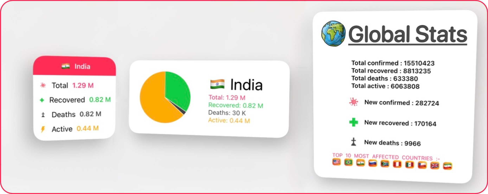

 <p float="left">
       
 </p>

#### A Covid-19 Tracking Widget for iOS 14


# WidgetKit

WidgetKit gives users ready access to content in apps by putting widgets on the iOS Home screen or macOS Notification Center. Widgets now come in multiple sizes, and users can visit the new widget gallery to search, preview sizes, and place them anywhere on the Home screen to access important details at a glance.
[Know more here](https://developer.apple.com/widgets/)

# Widgets
 <p float="left">
       
 </p>
 
 Widgets can be made in three sizes, namely : small , medium and large. Users can use their preferred size of widget on their choice of location in the homescreen. 
 
 # Preview
 
  <p float="left">
       
 </p>
The type of content that each widget shows varies based on users choice and widget size.

# Installation 🛠
- Clone / download this repository.
- change the bundle identifier in project settings.
- run the app.

 
## ⚠️ Xcode 12.0 or above is required to run this project.


# How to Use?
- Go to [CurrentCountry.swift](https://github.com/aaryankotharii/Corona-Widget/blob/master/Corona%20Widget/Widget/CurrentCountry.swift)

``` swift
struct CurrentCountry {
    static let country : Country = .india
}
```

- choose your choice of country from Country enumeraion. <b> default is 🇮🇳 India
- run the application
 
# Includes :
- SwiftUI
- WidgetKit
- Intents
- Combine
- Networking
- Charts
 
# Author
* [Aaryan Kothari](https://github.com/aaryankotharii)

# License

 Copyright 2020 [Aaryan Kothari.](https://github.com/aaryankotharii/Corona-Widget/blob/master/LICENSE)

 Licensed under MIT License: https://opensource.org/licenses/MIT

